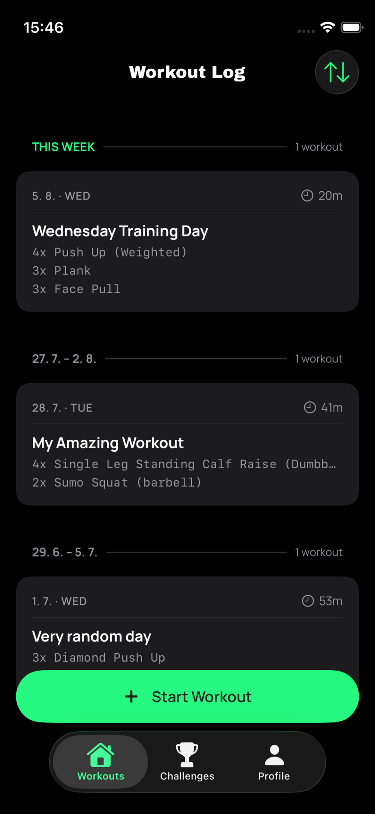
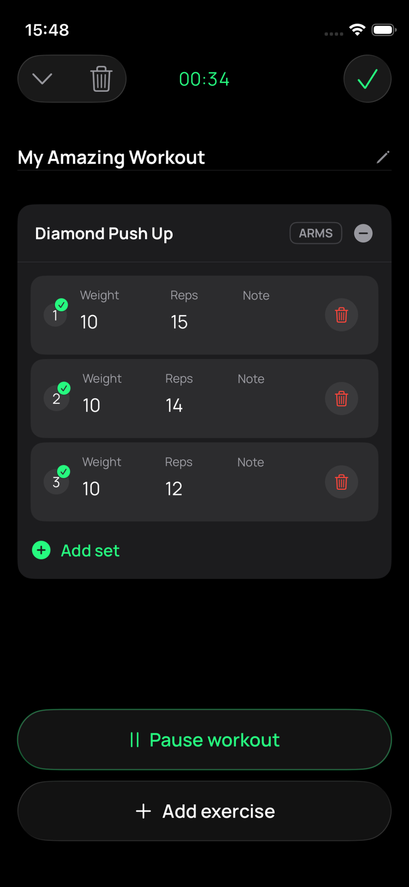
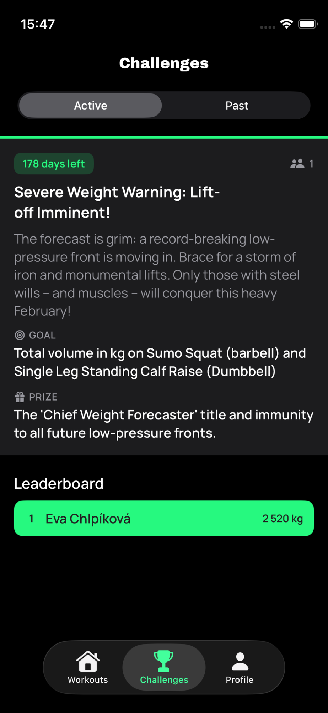
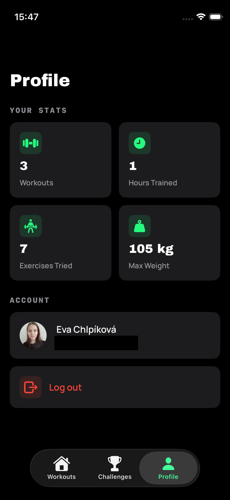

# Workouts and Challenges App (iOS)

A SwiftUI workout tracker with monthly team challenges. Log your sets between exercises,
follow along on the Lock Screen while you train, and compete on a leaderboard against a
challenge that writes itself each month.

Built with Swift 6, SwiftUI, SwiftData and Firebase.

## Screenshots

| Workout log | Active workout | Challenges | Profile |
|:---:|:---:|:---:|:---:|
|  |  |  |  |

## Tech stack

- **Swift 6** / **SwiftUI**, iOS 26 deployment target
- **SwiftData** — offline cache for workouts and the exercise library
- **Firebase** — Auth (Google provider) and Firestore
- **GoogleSignIn-iOS**
- **ActivityKit / WidgetKit** — Lock Screen and Dynamic Island Live Activity
- **ConfettiSwiftUI** — challenge-completion celebration
- **SwiftLint** — enforced as a build phase, configured in `.swiftlint.yml`
- **Node 20** + **Gemini API** — monthly challenge generation in CI

> The `GoogleService-Info-*.plist` files are committed deliberately. They are client
> configuration, not credentials — they ship inside every App Store binary and are
> extractable from any IPA. The backend is protected by Firestore security rules and
> Firebase App Check, not by keeping these files out of the repo.

## Features

**Workout logging**
- Start a workout, add exercises from a categorised library, and log weight, reps and notes per set
- Live timer with pause/resume, so a break doesn't inflate your session length
- History grouped by week with per-workout duration and exercise summary
- Exercises are either rep-based or duration-based, and tagged by muscle group
  (chest, back, legs, shoulders, arms, core, cardio)

**Live Activity**
- The running workout appears on the Lock Screen and in the Dynamic Island via the
  `WorkoutOverview` widget extension — current exercise, elapsed time and workout state,
  without unlocking the phone mid-set

**Monthly challenges**
- A new challenge appears on the 1st of every month with a goal, a joke prize and a
  shared leaderboard
- Goal types: total volume (kg), total duration, and workout count
- Your logged sets contribute automatically — no separate challenge entry step
- Challenge text is generated by an LLM in CI, not hardcoded (see
  [Challenge generation](#challenge-generation))

**Profile**
- Aggregate stats: workouts completed, hours trained, distinct exercises tried, max weight lifted
- Google Sign-In through Firebase Auth

**Throughout**
- Offline-first: workouts and the exercise library are cached in SwiftData, so the app is
  usable without a connection and syncs when it returns
- Localised in English and Czech
- VoiceOver support across the app

## Requirements

- Xcode 26 or newer
- iOS 26.0+ (deployment target)

## Architecture

The app follows the **Component / ComponentModel / Coordinator** pattern, vendored from
[FuturedKit](https://github.com/futuredapp/FuturedKit)'s `FuturedArchitecture` module into
`WorkoutTracker/Architecture/`.

| Piece | Responsibility |
|---|---|
| **Component** | A SwiftUI view. Renders state, forwards user intent to its component model. |
| **ComponentModel** | `@Observable @MainActor` class. Holds view state and emits `Event`s upward via an `onEvent` closure. Each has a protocol so previews and tests can use a mock. |
| **Coordinator** | Owns navigation and reacts to component events. Flow coordinators live in `FlowCoordinators/`, driving `NavigationStackFlow` and `TabViewFlow`. |
| **DataCache** | `@Observable @MainActor` container for shared mutable state. Reads and writes are synchronous from any `@MainActor` context; SwiftUI re-renders through the `@Observable` macro. |
| **Container** | Dependency container. `Container` holds app-wide services, `AuthenticatedContainer` those that only exist once a user is signed in. |

Everything user-facing is `@MainActor`-isolated by default, and the project builds under
Swift 6 strict concurrency.

Services in `WorkoutTracker/Service/` are protocol-first, each with an implementation and a
mock — `AuthService`, `WorkoutsService`, `ChallengeService`, `ExercisesService`,
`PersistenceService` (SwiftData), `LiveActivityService`, `NetworkMonitorService` and others.

### Project structure

```
WorkoutTracker/
├── Architecture/       Vendored FuturedKit: ComponentModel, Coordinator, DataCache, flows
├── FlowCoordinators/   Navigation per feature area (login, workouts, challenges, profile)
├── Scenes/             One folder per screen: Component + ComponentModel
├── Service/            Protocol-first services (Firebase, SwiftData, Live Activity, …)
├── Model/
│   ├── App/            Domain models (Workout, Exercise, Challenge, Goal, …)
│   ├── DB/             Firestore DTOs
│   └── SwiftData/      Local persistence models
├── Library/            Extensions and shared helpers
└── Resources/          Assets, fonts, Firebase plists

WorkoutOverview/        Live Activity widget extension
scripts/
├── configure-firebase.sh
└── generate-challenge/ Node script that generates the monthly challenge
docs/                   Design specs and implementation plans
```

## Challenge generation

Monthly challenges are created by a Node script (`scripts/generate-challenge/`) run from the
[Generate Monthly Challenge](.github/workflows/generate-challenge.yml) workflow on a cron at
00:05 UTC on the 1st of each month, and manually via `workflow_dispatch`.

The script picks a goal, asks **Gemini 2.5 Flash** to write the challenge's title,
description and prize, and writes the result straight to Firestore. Two details keep a year
of auto-generated copy from sounding samey:

- **Registers.** Each challenge is framed as a different genre — a dramatic weather
  warning, a mock scientific report, a movie-trailer voice-over, a deadpan office bulletin,
  sports commentary, or agile/dev speak. The register used is stored on the challenge, and
  the two most recently used ones are excluded from the next pick.
- **Designated months.** Goal types that aren't tied to specific exercises (workout count,
  overall duration) are pinned to one month each per year, so they can't recur often enough
  to feel repetitive.

The workflow needs two repository secrets: `GEMINI_API_KEY` and
`CHALLENGE_GENERATOR_FIREBASE_SERVICE_ACCOUNT`.
